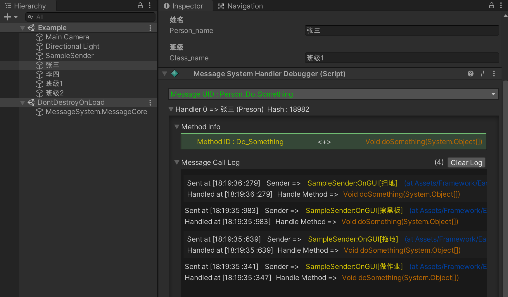

# 消息系统
* 拷贝 *Assets/Framework/EasyMessage* 路径下的全部文件到 Unity 工程中。
* 异步模式下，通过实现消息队列来保证消息的执行顺序。

## 1.1配置说明
* 配置文件路径为 *../Save/Resources/SaveDataConfig.asset* ,如下图所示:


|配置属性|解释|
|---|---|
|Sys Work Mode|消息系统工作模式。可以配置为同步或**异步(推荐)**工作模式|
|Debug Mode|是否开启调试模式|
|Open Log|是否开启Log|
## 1.2使用说明

* 引用 ***MessageSystem*** 命名空间,并实现消息处理接口。
* 单一消息UID处理接口
```c#
    /// <summary>
    /// 消息处理接口
    /// </summary>
    public interface IMessageHandler : IBaseMessageHandler
    {
        string getMessageUid { get; }
        void initHandleMethodMap(Dictionary<string, MessageHandleMethod> HandleMethodMap);
    }
```
* 多重消息UID处理接口
```c#
    /// <summary>
    /// 多重消息处理接口
    /// </summary>
    public interface IMultiMessageHandler : IBaseMessageHandler
    {
        void initMessageUids(List<string> MessageUids);
        void initHandleMethodMap(Dictionary<string, Dictionary<string, MessageHandleMethod>> HandleMethodMap);
    }
```
* 使用如下方法 ***注册/注销*** 消息监听
```c#
		//注册消息监听
    public class MessageCore : MonoBehaviour
    {
    		public static void RegisterHandler(IMessageHandler handler, 						MessageFilterMethod messageFilter = null)

    		public static void RegisterHandler(IMultiMessageHandler handler, 					MessageFilterMethod messageFilter = null)
    }
```
```c#
		//注销消息监听
    public class MessageCore : MonoBehaviour
    {
    		public static void UnregisterHandler(IMessageHandler handler)
    	
    		public static void UnregisterHandler(IMultiMessageHandler handler)
    }
```
* **注意:** 如果忘记在对象被销毁时注销消息监听，系统会在下次发送该消息时，主动移除已被销毁的监听者。但还是***推荐*** 根据对象的生命周期***主动注销消息的监听***。
---

* 使用如下方法发送消息
```c#
    public class MessageCore : MonoBehaviour
    {
    		public static void SendMessage(string msg_uid, string method_id,params object[] msg_params)
    }
```

* 可以通过实现消息过滤方法进行消息的过滤,并在消息注册时进行传递。此方式主要运用于过滤**同类型**的**不同实例**间的消息。
```c#
    /// <summary>
    /// 消息过滤委托,用于判断该对象是否满足过滤条件
    /// </summary>
    /// <param name="msg_uid">待处理的消息UID</param>
    /// <param name="mark">过滤参数</param>
    /// <returns>返回为真时，根据过滤模式判断是否触发</returns>
    public delegate bool MessageFilterMethod(string msg_uid, object mark);
```

* 使用如下方法可以使用过滤并发送消息
```c#
    public class MessageCore : MonoBehaviour
    {
        /// <summary>
        /// 发送消息，满足过滤条件的消息监听者将被触发。
        /// </summary>
        /// <param name="msg_uid">消息UID</param>
        /// <param name="method_id">子ID</param>
        /// <param name="filter_mark">过滤参数</param>
        /// <param name="msg_params">消息参数</param>
    		public static void SendMessageInclude(string msg_uid, string method_id, object[] filter_mark, params object[] msg_params)
    
    		/// <summary>
        /// 发送消息，满足过滤条件的消息监听者会被过滤。
        /// </summary>
        /// <param name="msg_uid">消息UID</param>
        /// <param name="method_id">子ID</param>
        /// <param name="filter_mark">过滤参数</param>
        /// <param name="msg_params">消息参数</param>
    		public static void SendMessageExcept(string msg_uid, string method_id, object[] filter_mark, params object[] msg_params)
    }
```

* 请参考 *../EasyMessage/Example* 下的例子使用。

## 1.3调试

* 配置中开启调试后，继承消息处理接口的 ***Monobehavior*** 对象可以在Inspector面板中查看调试面板。

* 可以查看该对象注册监听的消息信息。
* 可以查看该对象的消息相应记录，并且可以查看调用者的堆栈信息以及调用时参数的记录。

